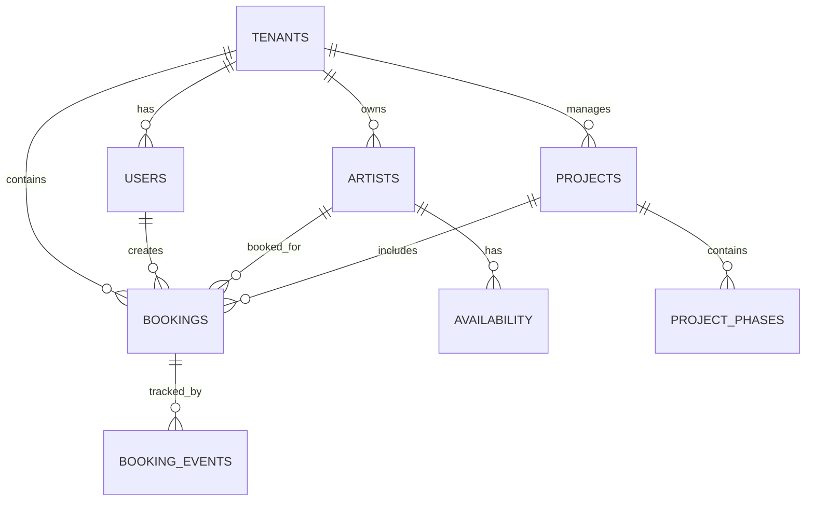

# Production Tool 2.0 - Complete Architecture Documentation

## ⚠️ IMPORTANT NOTICE

**NO DEVELOPMENT YET** - This document describes the planned architecture. Development has not started and will only begin after all architecture decisions are approved.

## Project Overview

**Production Tool 2.0** is an artist booking and project management platform designed for creative studios to efficiently allocate talent, manage schedules, and track project timelines with real-time collaboration.

## System Overview

The architecture follows a modular monolith pattern with clear separation of concerns and scalability in mind. The system is designed for a 2-person team using AI-assisted development, with infrastructure costs under €500/month for MVP.

## High-Level Architecture

```
┌─────────────────────────────────────────────────────────────┐
│                     Client (Browser)                        │
│                Next.js 15 + TypeScript                      │
│             Tailwind CSS + Shadcn/ui + Zustand             │
└─────────────────────┬───────────────────────────────────────┘
                      │ HTTPS/WSS
                      ▼
┌─────────────────────────────────────────────────────────────┐
│                   Vercel Edge Network                        │
│              (Frontend + API Routes)                        │
└─────────────────────┬───────────────────────────────────────┘
                      │
                      ▼
┌─────────────────────────────────────────────────────────────┐
│                  Application Core                           │
│           Next.js API Routes + Middleware                   │
│         Clerk Auth + Drizzle ORM + Socket.IO               │
└─────────────┬──────────────────────┬────────────────────────┘
              │                      │
              ▼                      ▼
┌──────────────────────┐    ┌────────────────────────────┐
│   PostgreSQL (Neon)  │    │      Redis (Railway)       │
│   Primary Database   │    │   Cache + Message Queue    │
│   Multi-tenant RLS   │    │    Real-time Events        │
└──────────────────────┘    └────────────────────────────┘
```

## Architecture Principles

### 1. Modular Monolith
- **Single deployable unit** with clear module boundaries
- **Domain-driven structure** organized by business capabilities
- **Future microservices readiness** with well-defined interfaces
- **Shared database** with proper isolation via row-level security

### 2. Event-Driven Design
- **Asynchronous processing** for non-critical operations
- **Real-time updates** via Socket.IO events
- **Loose coupling** between components
- **Reliable message delivery** with Redis as message broker

### 3. Multi-Tenant Architecture
- **Row-level security (RLS)** for data isolation
- **Shared schema** with tenant_id columns
- **Tenant context** set at request level
- **Scalable** for thousands of tenants

### 4. API-First Design
- **RESTful APIs** with consistent patterns
- **Type-safe contracts** with Zod validation
- **Version management** with /api/v1 prefix
- **GraphQL ready** for complex queries

## Technology Stack

### Frontend Layer
```typescript
// Core Technologies
Next.js 15           // React framework with App Router
TypeScript 5.x       // Type safety and developer experience
Tailwind CSS 4.x     // Utility-first styling
Shadcn/ui           // Component library on Radix UI

// State Management
Zustand 4.x         // Lightweight state management
React Hook Form     // Form handling
Zod 3.x            // Runtime validation

// Real-time
Socket.IO Client    // WebSocket communication
```

### Backend Layer
```typescript
// Runtime & Framework
Node.js 20 LTS      // JavaScript runtime
Next.js API Routes  // Backend API layer
Express.js          // HTTP server (for Socket.IO)

// Database & ORM
Drizzle ORM 0.36.x  // Type-safe database ORM
PostgreSQL 15       // Primary database
Redis 7.x           // Cache and message queue

// Authentication
Clerk               // User management and authentication
JWT                 // Session tokens

// Real-time
Socket.IO Server    // WebSocket server
Redis Adapter       // Horizontal scaling for Socket.IO
```

### Infrastructure Layer
```yaml
Hosting:
  Frontend: Vercel (Edge Network)
  Database: Neon (Managed PostgreSQL)
  Cache: Railway Redis
  Files: Cloudflare R2
  CDN: Cloudflare

Monitoring:
  Errors: Sentry
  Performance: Vercel Analytics
  Logs: Railway/Vercel Logs

CI/CD:
  Source: GitHub
  Pipeline: GitHub Actions
  Deployment: Vercel + Railway
```

## Database Architecture

### Core Entity Relationships


### Key Database Features

#### GIST Exclusion Constraints
```sql
-- Prevents double bookings at database level
ALTER TABLE bookings 
ADD CONSTRAINT no_double_booking 
EXCLUDE USING gist (
  artist_id WITH =,
  tstzrange(start_time, end_time, '[)') WITH &&
) WHERE (status IN ('confirmed', 'pencil'));
```

#### Event Sourcing
- Complete audit trail of all booking changes
- Event-driven architecture support
- Time-travel debugging capabilities

#### Row-Level Security
```sql
-- Tenant isolation
CREATE POLICY tenant_isolation ON bookings
    FOR ALL
    USING (tenant_id = current_setting('app.current_tenant')::UUID);
```

## Core Features Implementation

### Artist Booking System
- **Hold/Pencil/Confirmed** status workflow
- **Automatic hold expiration** with database triggers
- **Conflict-free scheduling** via GIST constraints
- **Real-time availability** updates across all users
- **Optimistic locking** for concurrent updates

### Project Management
- **Gantt chart visualization** with project phases
- **Phase dependencies** tracking
- **Progress monitoring** (0-100%)
- **Timeline visualization** with drag-and-drop
- **Milestone tracking**

### Real-time Collaboration
- **WebSocket-based** live updates
- **Event sourcing** for complete audit trail
- **Optimistic UI** for instant feedback
- **Multi-user conflict resolution**
- **Presence awareness** (who's viewing what)

## API Architecture

### RESTful Design Patterns

#### Resource-Based URLs
```typescript
// Bookings API
GET    /api/v1/bookings              // List with filters
POST   /api/v1/bookings              // Create new
GET    /api/v1/bookings/[id]         // Get specific
PATCH  /api/v1/bookings/[id]         // Update
DELETE /api/v1/bookings/[id]         // Delete

// Resource availability
POST   /api/v1/bookings/check-availability
GET    /api/v1/artists/[id]/availability

// Nested resources
GET    /api/v1/projects/[id]/bookings
GET    /api/v1/artists/[id]/bookings
```

#### Request/Response Patterns
```typescript
// Consistent response format
interface ApiResponse<T> {
  data: T;
  meta?: {
    total?: number;
    page?: number;
    limit?: number;
  };
  error?: string;
}

// Validation with Zod
const CreateBookingSchema = z.object({
  artistId: z.string().uuid(),
  projectId: z.string().uuid().optional(),
  startTime: z.string().datetime(),
  endTime: z.string().datetime(),
  title: z.string().min(1).max(255),
  notes: z.string().optional(),
});
```

## Performance Architecture

### Multi-Layer Caching
1. **L1 Cache**: In-memory (application level)
   - Hot data: active bookings, user sessions
   - TTL: 5 minutes

2. **L2 Cache**: Redis (shared across instances)
   - Frequently accessed data
   - TTL: 15-60 minutes

3. **L3 Cache**: CDN Edge (Cloudflare)
   - Static assets and API responses
   - TTL: 1-24 hours

### Query-Level Caching Strategy
```typescript
// Smart query cache with automatic dependency tracking
class SmartQueryCache {
  async executeQuery<T>(
    queryKey: string,
    queryFn: () => Promise<T>,
    options?: {
      ttl?: number;
      tables?: string[];
      tags?: string[];
    }
  ): Promise<T> {
    // Check cache first
    const cached = this.queryCache.get(queryKey);
    if (cached && !this.isExpired(cached)) {
      return cached.data as T;
    }
    
    // Execute query with dependency tracking
    const result = await queryFn();
    
    // Cache result with automatic invalidation
    this.cacheResult(queryKey, result, options);
    
    return result;
  }
  
  // Intelligent cache invalidation by table or tags
  async invalidateTable(table: string): Promise<void> {
    const affected = this.tableDependencies.get(table) || new Set();
    for (const queryKey of affected) {
      this.queryCache.delete(queryKey);
    }
  }
}
```

### Database Optimizations
- **Composite indexes** for common query patterns
- **Materialized views** for analytics
- **Connection pooling** with PgBouncer
- **Query optimization** with EXPLAIN ANALYZE
- **Partial indexes** for filtered queries
- **Query plan caching** for repeated patterns

### Frontend Optimizations
- **React Server Components** for initial load
- **Code splitting** with dynamic imports
- **Optimistic updates** for perceived performance
- **Virtual scrolling** for large lists
- **Intersection Observer** for lazy loading
- **Service Worker** for offline support

## Security Architecture

### Authentication Flow
1. User accesses protected route
2. Clerk middleware checks session
3. Valid session → Continue / Invalid → Redirect to login
4. Set user context in database
5. Apply tenant RLS policies
6. Process request with tenant isolation

### Authorization Layers
```typescript
// Role-based access control
const permissions = {
  studio_owner: ['*'],
  studio_manager: [
    'bookings:create', 'bookings:read', 'bookings:update',
    'artists:read', 'projects:*'
  ],
  freelancer: [
    'bookings:read:own', 'bookings:respond',
    'profile:update', 'availability:manage'
  ]
};
```

### Data Security
- **Row-level security** for multi-tenant isolation
- **Input validation** with Zod schemas
- **SQL injection prevention** via parameterized queries
- **Rate limiting** to prevent abuse
- **HTTPS enforcement** in production
- **CORS configuration** for API access

## Figma Integration

### Design-to-Code Pipeline

#### 1. Figma MCP (Model Context Protocol)
- Direct connection between Figma and Claude
- Component extraction and specification
- Real-time design updates

#### 2. Figma Code Connect
- Type-safe component mapping
- Automatic prop generation
- Framework-specific code output

#### 3. Development Workflow
1. Design component in Figma with proper naming
2. Use Dev Mode to extract specifications
3. Generate component with Claude/Cursor: "Implement the BookingCard component from Figma"
4. AI generates type-safe, accessible component

## Implementation Status

### ✅ Completed (Pre-Development)
- Enhanced database schema with all required tables
- GIST constraint implementation design
- Event sourcing architecture design
- Hold/pencil booking system design
- Project management schema
- Multi-layer caching architecture
- Figma integration documentation
- Complete architecture documentation

### 🚧 Pending Development
- WebSocket server setup
- UI component implementation
- API endpoint development
- Real-time synchronization
- Authentication middleware
- Testing infrastructure
- Deployment configuration

## Observability & Monitoring

### OpenTelemetry Integration
```typescript
// Distributed tracing setup
const sdk = new NodeSDK({
  resource: new Resource({
    [SemanticResourceAttributes.SERVICE_NAME]: 'production-tool-api',
    [SemanticResourceAttributes.SERVICE_VERSION]: process.env.VERSION,
  }),
  instrumentations: [
    getNodeAutoInstrumentations(),
    // Custom business metrics
    new BookingInstrumentation(),
  ],
  traceExporter: new OTLPTraceExporter({
    url: process.env.OTEL_ENDPOINT
  }),
});
```

### Business Metrics
- **Booking Metrics**: Creation rate, duration, conflicts
- **Resource Utilization**: Availability vs booked time
- **User Activity**: Active users, session duration
- **Performance KPIs**: Response times, error rates

### Structured Logging
```typescript
// Correlation across distributed systems
logger.info({
  message: 'Booking created',
  traceId: context?.traceId,
  spanId: context?.spanId,
  bookingId: booking.id,
  tenantId: booking.tenantId,
  duration: responseTime
});
```

## Testing Architecture

### Test Pyramid
1. **Unit Tests** (70%)
   - Business logic validation
   - Component testing
   - Utility functions

2. **Integration Tests** (20%)
   - API endpoint testing
   - Database operations
   - External service mocks

3. **E2E Tests** (10%)
   - Critical user journeys
   - Cross-browser testing
   - Performance scenarios

### Testing Strategies
- **Contract Testing**: API compatibility with Pact
- **Property-Based Testing**: Edge case discovery with fast-check
- **Visual Regression**: UI consistency with Chromatic
- **Mutation Testing**: Test quality verification

## Deployment Architecture

### CI/CD Pipeline
```yaml
# GitHub Actions workflow
Trigger: Push to main/develop
  ↓
Tests: Unit + Integration + E2E
  ↓
Security: Audit + Vulnerability scan
  ↓
Build: Next.js production build
  ↓
Deploy: Vercel (frontend) + Railway (services)
  ↓
Verify: Health checks + Smoke tests
```

### Environment Strategy
- **Development**: Local with Docker Compose
- **Staging**: Vercel preview deployments
- **Production**: Vercel + managed services

## Cost Analysis

### MVP Phase (€50-100/month)
- Railway: €5 (Hobby) + €20 (usage)
- Vercel: €20 (Pro)
- Neon: €0 (Free tier)
- Cloudflare: €0 (Free tier)
- Clerk: €0 (Free tier - 10K MAU)

### Growth Phase (€200-300/month)
- Railway: €20 (Pro) + €50 (usage)
- Neon: €19 (Launch plan)
- Clerk: €25 (Pro plan)
- Sentry: €26 (Team plan)
- Email: €20 (SendGrid)

## Required Approvals Before Development

### ✅ Database Schema
- [x] Artists table for people-only bookings
- [x] GIST constraints for conflict prevention
- [x] Event sourcing for audit trail
- [x] Project phases for Gantt charts
- [x] Hold/pencil booking statuses

### ⏳ Technical Stack Confirmation
- [ ] PostgreSQL with Neon hosting
- [ ] Socket.IO for real-time
- [ ] Clerk for authentication
- [ ] Redis for caching/queuing

### ⏳ Architecture Patterns
- [ ] Modular monolith approach
- [ ] Event-driven design
- [ ] Multi-tenant with RLS
- [ ] Optimistic UI updates

### ⏳ Infrastructure Services
- [ ] Vercel for frontend hosting
- [ ] Railway for Redis
- [ ] Neon for PostgreSQL
- [ ] Cloudflare for CDN/storage

## Questions Requiring Answers

1. **Booking Workflow**: Is the hold/pencil/confirmed status workflow correct?
2. **Artist Types**: Should we support additional artist types beyond the current list?
3. **Project Features**: Are Gantt charts and phase dependencies sufficient?
4. **Real-time Scope**: Any additional real-time features needed?
5. **Performance Targets**: Specific response time requirements?

## Next Steps (After Approval)

1. **Infrastructure Setup**: Configure all hosting services
2. **Development Environment**: Set up local development
3. **Base Implementation**: Authentication and routing
4. **Core Features**: Booking system first
5. **UI Development**: Figma-to-code workflow
6. **Testing**: Unit tests alongside development
7. **Deployment**: CI/CD pipeline setup

---

**⚠️ REMINDER: This is a pre-development architecture document. No code has been written yet. Development will only begin after all decisions are approved.**

**Last Updated**: January 2025
**Status**: Awaiting Approval
**Team**: 2-person development team with AI assistance