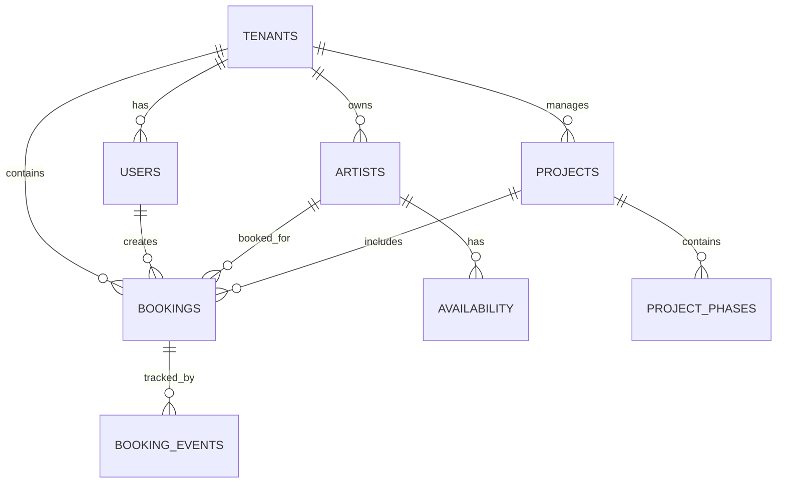

# Production Tool 2.0 - Complete Architecture Documentation

## 📋 IMPLEMENTATION STATUS

**Architecture Approved** - Ready for implementation. This document serves as the definitive technical specification for Production Tool 2.0. All architecture decisions have been reviewed and approved, including the recent improvements proposed in the system design analysis.

## Project Overview

**Production Tool 2.0** is an artist booking and project management platform designed for creative studios to efficiently allocate talent, manage schedules, and track project timelines with real-time collaboration.

## System Overview

The architecture follows a separated frontend/backend pattern with clear API boundaries and scalability in mind. The system uses a monorepo structure managed by Turborepo, designed for a 2-person team using AI-assisted development, with infrastructure costs under €500/month for MVP.

## High-Level Architecture

```
┌─────────────────────────────────────────────────────────────┐
│                     Client (Browser)                        │
│                Next.js 15 + TypeScript                      │
│             Tailwind CSS + Shadcn/ui + Zustand             │
└─────────────────────┬───────────────────────────────────────┘
                      │ HTTPS
                      ▼
┌─────────────────────────────────────────────────────────────┐
│                   Vercel Edge Network                        │
│                  (Frontend Only - SSR/SSG)                  │
└─────────────────────┬───────────────────────────────────────┘
                      │ API Calls (HTTPS/WSS)
                      ▼
┌─────────────────────────────────────────────────────────────┐
│                    NestJS Backend API                       │
│                  Railway/DigitalOcean                       │
│         REST API + Socket.IO + Background Jobs              │
│         Clerk Auth + Drizzle ORM + Business Logic          │
└─────────────┬──────────────────────┬────────────────────────┘
              │                      │
              ▼                      ▼
┌──────────────────────┐    ┌────────────────────────────┐
│   PostgreSQL (Neon)  │    │      Redis (Railway)       │
│   Primary Database   │    │   Cache + Message Queue    │
│   Multi-tenant RLS   │    │    Real-time Events        │
└──────────────────────┘    └────────────────────────────┘
```

## Architecture Principles

### 1. Separated Frontend/Backend
- **Independent deployments** for frontend and backend
- **Clear API boundaries** with versioned endpoints
- **Technology independence** allowing UI redesigns without backend changes
- **Monorepo structure** with shared types and utilities

### 2. Event-Driven Design
- **Asynchronous processing** for non-critical operations
- **Real-time updates** via Socket.IO events
- **Loose coupling** between components
- **Reliable message delivery** with Redis as message broker

### 3. Multi-Tenant Architecture
- **Row-level security (RLS)** for data isolation
- **Shared schema** with tenant_id columns
- **Tenant context** set at request level
- **Scalable** for thousands of tenants

### 4. API-First Design
- **RESTful APIs** with consistent patterns
- **Type-safe contracts** with Zod validation
- **Version management** with /api/v1 prefix
- **GraphQL ready** for complex queries

### 5. Security-First Architecture
- **Zero-trust model** with no super admin access
- **Complete tenant isolation** at all layers
- **Comprehensive audit trail** for all operations
- **Defense in depth** with multiple security layers

## Technology Stack

### Frontend Layer
```typescript
// Core Technologies
Next.js 15           // React framework with App Router
TypeScript 5.x       // Type safety and developer experience
Tailwind CSS 4.x     // Utility-first styling
Shadcn/ui           // Component library on Radix UI

// State Management
Zustand 4.x         // Lightweight state management
React Hook Form     // Form handling
Zod 3.x            // Runtime validation

// Real-time
Socket.IO Client    // WebSocket communication
```

### Backend Layer
```typescript
// Runtime & Framework
Node.js 20 LTS      // JavaScript runtime
NestJS 10.x         // Enterprise Node.js framework
Fastify             // High-performance HTTP server

// Database & ORM
Drizzle ORM 0.36.x  // Type-safe database ORM
PostgreSQL 15       // Primary database
Redis 7.x           // Cache and message queue

// Authentication
Clerk               // User management and authentication
JWT                 // Session tokens

// Real-time
Socket.IO Server    // WebSocket server
Redis Adapter       // Horizontal scaling for Socket.IO

// Background Jobs
Bull                // Redis-based queue for jobs
```

### Infrastructure Layer
```yaml
Hosting:
  Frontend: Vercel (Edge Network)
  Backend: Railway or DigitalOcean
  Database: Neon (Managed PostgreSQL)
  Cache: Railway Redis
  Files: Cloudflare R2
  CDN: Cloudflare

Monitoring:
  Errors: Sentry
  Performance: Vercel Analytics + Backend APM
  Logs: Railway/DigitalOcean Logs

CI/CD:
  Source: GitHub (Monorepo)
  Pipeline: GitHub Actions
  Deployment: Vercel (frontend) + Railway (backend)
```

## Monorepo Structure

The project uses Turborepo for efficient monorepo management:

```
production-tool/
├── apps/
│   ├── web/                 # Next.js frontend application
│   │   ├── app/            # App router pages
│   │   ├── components/     # React components
│   │   ├── lib/           # Frontend utilities
│   │   └── public/        # Static assets
│   │
│   └── api/                 # NestJS backend application
│       ├── src/
│       │   ├── modules/    # Feature modules
│       │   ├── common/     # Shared utilities
│       │   └── main.ts     # Application entry
│       └── test/          # Backend tests
│
├── packages/
│   ├── shared-types/        # Shared TypeScript types/interfaces
│   │   ├── booking.ts      # Booking-related types
│   │   ├── artist.ts       # Artist-related types
│   │   └── index.ts        # Type exports
│   │
│   ├── ui/                  # Shared UI components
│   │   ├── components/     # Reusable components
│   │   └── styles/        # Shared styles
│   │
│   └── config/              # Shared configuration
│       ├── eslint/        # ESLint configs
│       └── typescript/    # TypeScript configs
│
├── turbo.json              # Turborepo configuration
├── package.json            # Root package.json
└── pnpm-workspace.yaml     # PNPM workspace config
```

### Benefits of This Structure

1. **Type Safety**: Shared types ensure frontend/backend consistency
2. **Code Reuse**: Common utilities and components shared across apps
3. **Independent Scaling**: Frontend and backend can be deployed separately
4. **Clear Boundaries**: Each app has its own dependencies and build process
5. **Efficient Builds**: Turborepo caches and optimizes builds

## Database Architecture

### Core Entity Relationships


### Key Database Features

#### GIST Exclusion Constraints
```sql
-- Prevents double bookings at database level
ALTER TABLE bookings 
ADD CONSTRAINT no_double_booking 
EXCLUDE USING gist (
  artist_id WITH =,
  tstzrange(start_time, end_time, '[)') WITH &&
) WHERE (status IN ('confirmed', 'pencil'));
```

#### Event Sourcing
- Complete audit trail of all booking changes
- Event-driven architecture support
- Time-travel debugging capabilities

#### Row-Level Security
```sql
-- Tenant isolation
CREATE POLICY tenant_isolation ON bookings
    FOR ALL
    USING (tenant_id = current_setting('app.current_tenant')::UUID);
```

## Core Features Implementation

### Artist Booking System
- **Hold/Pencil/Confirmed** status workflow
- **Automatic hold expiration** with database triggers
- **Conflict-free scheduling** via GIST constraints
- **Real-time availability** updates across all users
- **Optimistic locking** for concurrent updates

### Project Management
- **Gantt chart visualization** with project phases
- **Phase dependencies** tracking
- **Progress monitoring** (0-100%)
- **Timeline visualization** with drag-and-drop
- **Milestone tracking**

### Real-time Collaboration
- **WebSocket-based** live updates
- **Event sourcing** for complete audit trail
- **Optimistic UI** for instant feedback
- **Multi-user conflict resolution**
- **Presence awareness** (who's viewing what)

## API Architecture

### RESTful Design Patterns

#### Resource-Based URLs
```typescript
// Bookings API
GET    /api/v1/bookings              // List with filters
POST   /api/v1/bookings              // Create new
GET    /api/v1/bookings/[id]         // Get specific
PATCH  /api/v1/bookings/[id]         // Update
DELETE /api/v1/bookings/[id]         // Delete

// Resource availability
POST   /api/v1/bookings/check-availability
GET    /api/v1/artists/[id]/availability

// Nested resources
GET    /api/v1/projects/[id]/bookings
GET    /api/v1/artists/[id]/bookings
```

#### Request/Response Patterns
```typescript
// Consistent response format
interface ApiResponse<T> {
  data: T;
  meta?: {
    total?: number;
    page?: number;
    limit?: number;
  };
  error?: string;
}

// Validation with Zod
const CreateBookingSchema = z.object({
  artistId: z.string().uuid(),
  projectId: z.string().uuid().optional(),
  startTime: z.string().datetime(),
  endTime: z.string().datetime(),
  title: z.string().min(1).max(255),
  notes: z.string().optional(),
});
```

## Performance Architecture

### Multi-Layer Caching
1. **L1 Cache**: In-memory (application level)
   - Hot data: active bookings, user sessions
   - TTL: 5 minutes

2. **L2 Cache**: Redis (shared across instances)
   - Frequently accessed data
   - TTL: 15-60 minutes

3. **L3 Cache**: CDN Edge (Cloudflare)
   - Static assets and API responses
   - TTL: 1-24 hours

### Query-Level Caching Strategy
```typescript
// Smart query cache with automatic dependency tracking
class SmartQueryCache {
  async executeQuery<T>(
    queryKey: string,
    queryFn: () => Promise<T>,
    options?: {
      ttl?: number;
      tables?: string[];
      tags?: string[];
    }
  ): Promise<T> {
    // Check cache first
    const cached = this.queryCache.get(queryKey);
    if (cached && !this.isExpired(cached)) {
      return cached.data as T;
    }
    
    // Execute query with dependency tracking
    const result = await queryFn();
    
    // Cache result with automatic invalidation
    this.cacheResult(queryKey, result, options);
    
    return result;
  }
  
  // Intelligent cache invalidation by table or tags
  async invalidateTable(table: string): Promise<void> {
    const affected = this.tableDependencies.get(table) || new Set();
    for (const queryKey of affected) {
      this.queryCache.delete(queryKey);
    }
  }
}
```

### Database Optimizations
- **Composite indexes** for common query patterns
- **Materialized views** for analytics
- **Connection pooling** with PgBouncer
- **Query optimization** with EXPLAIN ANALYZE
- **Partial indexes** for filtered queries
- **Query plan caching** for repeated patterns

### Frontend Optimizations
- **React Server Components** for initial load
- **Code splitting** with dynamic imports
- **Optimistic updates** for perceived performance
- **Virtual scrolling** for large lists
- **Intersection Observer** for lazy loading
- **Service Worker** for offline support

## Security Architecture

### Authentication Flow
1. User accesses protected route
2. Clerk middleware checks session
3. Valid session → Continue / Invalid → Redirect to login
4. Set user context in database
5. Apply tenant RLS policies
6. Process request with tenant isolation

### Authorization Layers
```typescript
// Role-based access control
const permissions = {
  studio_owner: ['*'],
  studio_manager: [
    'bookings:create', 'bookings:read', 'bookings:update',
    'artists:read', 'projects:*'
  ],
  freelancer: [
    'bookings:read:own', 'bookings:respond',
    'profile:update', 'availability:manage'
  ]
};
```

### Data Security
- **Row-level security** for multi-tenant isolation
- **Input validation** with Zod schemas
- **SQL injection prevention** via parameterized queries
- **Rate limiting** to prevent abuse
- **HTTPS enforcement** in production
- **CORS configuration** for API access

## Figma Integration

### Design-to-Code Pipeline

#### 1. Figma MCP (Model Context Protocol)
- Direct connection between Figma and Claude
- Component extraction and specification
- Real-time design updates

#### 2. Figma Code Connect
- Type-safe component mapping
- Automatic prop generation
- Framework-specific code output

#### 3. Development Workflow
1. Design component in Figma with proper naming
2. Use Dev Mode to extract specifications
3. Generate component with Claude/Cursor: "Implement the BookingCard component from Figma"
4. AI generates type-safe, accessible component

## Module Architecture

### Core Backend Modules

#### Artist Module
- **Purpose**: Manage artist profiles, portfolios, and availability
- **Key Features**:
  - Artist profile management with rich media portfolios
  - Skill and experience tracking
  - Availability calendar and scheduling preferences
  - Performance metrics and booking history
- **API Endpoints**: `/api/v1/artists/*`, `/api/v1/artist-profiles/*`

#### Booking Module
- **Purpose**: Handle all booking operations with conflict prevention
- **Key Features**:
  - GIST constraint-based conflict prevention
  - Hold/pencil/confirmed booking workflow
  - Real-time availability updates
  - Event sourcing for complete audit trail
- **API Endpoints**: `/api/v1/bookings/*`

#### Jobs Module
- **Purpose**: Job marketplace for connecting studios with artists
- **Key Features**:
  - Job listing creation and management
  - Application tracking and status workflow
  - Skill-based matching and recommendations
  - Saved jobs and notification system
- **API Endpoints**: `/api/v1/jobs/*`, `/api/v1/job-applications/*`

#### Project Module
- **Purpose**: Project management with Gantt visualization
- **Key Features**:
  - Project phases and dependencies
  - Milestone tracking
  - Resource allocation across projects
  - Progress monitoring and reporting
- **API Endpoints**: `/api/v1/projects/*`, `/api/v1/project-phases/*`

#### Tenant Module
- **Purpose**: Multi-tenant management and isolation
- **Key Features**:
  - Complete data isolation per studio
  - Tenant-scoped user management
  - Settings and preferences per tenant
  - No super admin access across tenants
- **API Endpoints**: `/api/v1/tenants/*`

### Common Services

#### Data Version History Service
- **Purpose**: Track all data changes for audit and recovery
- **Features**:
  - Every change creates a version entry
  - Instant rollback to any version
  - Change comparison and delta tracking
  - Automated cleanup of old versions

#### Backup Service
- **Purpose**: Comprehensive backup and recovery
- **Features**:
  - Multi-layer backup strategy
  - Point-in-time recovery capability
  - Tenant-specific backup exports
  - Automated backup validation

#### Notification Service
- **Purpose**: Multi-channel notification delivery
- **Features**:
  - In-app, email, and push notifications
  - Template-based message generation
  - Delivery tracking and retry logic
  - User preference management

## Implementation Status

### ✅ Phase 1: Architecture & Design (COMPLETED)
- Enhanced database schema with all required tables
- Artist profiles and job listings tables added
- GIST constraint implementation design
- Event sourcing architecture design
- Hold/pencil booking system design
- Project management schema
- Multi-layer caching architecture
- Security isolation policy with zero-trust model
- Comprehensive backup and recovery strategy
- Data version history system design
- Module architecture for all features
- Figma integration documentation
- Complete architecture documentation
- System design improvements documented
- All technical decisions recorded (TDR-001 through TDR-011)

### 🚧 Phase 2: Foundation Setup (READY TO START)
- [ ] Monorepo initialization with Turborepo
- [ ] Frontend app setup (Next.js 15)
- [ ] Backend app setup (NestJS)
- [ ] Shared packages creation
- [ ] Development environment configuration
- [ ] Database schema implementation
- [ ] Docker Compose setup

### 📅 Phase 3: Core Infrastructure (Week 2)
- [ ] Authentication setup (Clerk)
- [ ] Tenant isolation implementation
- [ ] Base API structure
- [ ] WebSocket server setup (Socket.IO)
- [ ] CI/CD pipeline configuration
- [ ] OpenAPI documentation setup

### 📅 Phase 4: Core Features (Weeks 3-4)
- [ ] Booking system API
- [ ] Booking UI components
- [ ] Artist management
- [ ] Project management
- [ ] Real-time updates

### 📅 Phase 5: Enhanced Features (Weeks 5-6)
- [ ] Artist profiles
- [ ] Job listings
- [ ] Availability system
- [ ] Notification system
- [ ] Search and filtering

### 📅 Phase 6: Quality & Performance (Week 7)
- [ ] Performance optimization
- [ ] Security hardening
- [ ] Testing suite
- [ ] Documentation updates
- [ ] Monitoring setup

### 📅 Phase 7: Deployment (Week 8)
- [ ] Production environment setup
- [ ] Deployment automation
- [ ] Performance testing
- [ ] Security audit
- [ ] Launch preparation

## Observability & Monitoring

### OpenTelemetry Integration
```typescript
// Distributed tracing setup
const sdk = new NodeSDK({
  resource: new Resource({
    [SemanticResourceAttributes.SERVICE_NAME]: 'production-tool-api',
    [SemanticResourceAttributes.SERVICE_VERSION]: process.env.VERSION,
  }),
  instrumentations: [
    getNodeAutoInstrumentations(),
    // Custom business metrics
    new BookingInstrumentation(),
  ],
  traceExporter: new OTLPTraceExporter({
    url: process.env.OTEL_ENDPOINT
  }),
});
```

### Business Metrics
- **Booking Metrics**: Creation rate, duration, conflicts
- **Resource Utilization**: Availability vs booked time
- **User Activity**: Active users, session duration
- **Performance KPIs**: Response times, error rates

### Structured Logging
```typescript
// Correlation across distributed systems
logger.info({
  message: 'Booking created',
  traceId: context?.traceId,
  spanId: context?.spanId,
  bookingId: booking.id,
  tenantId: booking.tenantId,
  duration: responseTime
});
```

## Testing Architecture

### Test Pyramid
1. **Unit Tests** (70%)
   - Business logic validation
   - Component testing
   - Utility functions

2. **Integration Tests** (20%)
   - API endpoint testing
   - Database operations
   - External service mocks

3. **E2E Tests** (10%)
   - Critical user journeys
   - Cross-browser testing
   - Performance scenarios

### Testing Strategies
- **Contract Testing**: API compatibility with Pact
- **Property-Based Testing**: Edge case discovery with fast-check
- **Visual Regression**: UI consistency with Chromatic
- **Mutation Testing**: Test quality verification

## Deployment Architecture

### CI/CD Pipeline
```yaml
# GitHub Actions workflow (Monorepo-aware)
Trigger: Push to main/develop
  ↓
Changed Detection: Turborepo identifies affected packages
  ↓
Parallel Testing: 
  - Frontend: Unit + Component + E2E tests
  - Backend: Unit + Integration + E2E tests
  ↓
Security: Audit + Vulnerability scan (all packages)
  ↓
Parallel Builds:
  - Frontend: Next.js production build
  - Backend: NestJS production build
  ↓
Parallel Deployments:
  - Frontend → Vercel
  - Backend → Railway/DigitalOcean
  ↓
Verify: Health checks + Smoke tests + API contract tests
```

### Environment Strategy
- **Development**: Local with Docker Compose
- **Staging**: Vercel preview deployments
- **Production**: Vercel + managed services

## Cost Analysis

### MVP Phase (€70-120/month)
- Railway/DigitalOcean: €20-40 (Backend hosting)
- Vercel: €20 (Pro for frontend)
- Neon: €0 (Free tier)
- Cloudflare: €0 (Free tier)
- Clerk: €0 (Free tier - 10K MAU)

### Growth Phase (€200-300/month)
- Railway: €20 (Pro) + €50 (usage)
- Neon: €19 (Launch plan)
- Clerk: €25 (Pro plan)
- Sentry: €26 (Team plan)
- Email: €20 (SendGrid)

## Architecture Decisions & Approvals

### ✅ Database Schema (APPROVED)
- [x] Artists table for people-only bookings
- [x] GIST constraints for conflict prevention
- [x] Event sourcing for audit trail
- [x] Project phases for Gantt charts
- [x] Hold/pencil booking statuses
- [x] Data version history for all changes
- [x] Backup snapshots table

### ✅ Technical Stack (APPROVED)
- [x] PostgreSQL 15 with Neon hosting
- [x] Socket.IO for real-time updates
- [x] Clerk for authentication
- [x] Redis for caching/queuing
- [x] Next.js 15 with App Router
- [x] NestJS for backend API
- [x] Drizzle ORM for database
- [x] Turborepo for monorepo

### ✅ Architecture Patterns (APPROVED)
- [x] Separated frontend/backend (TDR-011)
- [x] Event-driven design
- [x] Multi-tenant with RLS
- [x] Optimistic UI updates
- [x] CQRS for read/write separation
- [x] Event sourcing for audit trail

### ✅ Infrastructure Services (APPROVED)
- [x] Vercel for frontend hosting
- [x] Railway/DigitalOcean for backend
- [x] Railway for Redis
- [x] Neon for PostgreSQL
- [x] Cloudflare for CDN/storage
- [x] Sentry for error tracking
- [x] GitHub Actions for CI/CD

## Implementation Guidelines

### Development Workflow
1. **Start Here**: See `docs/guides/implementation-guide.md` for step-by-step instructions
2. **Project Structure**: Follow `docs/guides/project-structure.md` for file organization
3. **API Design**: Reference `docs/api/api-design.md` for endpoint specifications
4. **Development Setup**: Use `docs/setup.md` for environment configuration

### Key Implementation Principles
- **Type Safety First**: Use TypeScript strict mode and shared types
- **API-First Design**: Build backend endpoints before frontend
- **Test-Driven**: Write tests alongside implementation
- **Security by Default**: Apply tenant isolation at all layers
- **Performance Conscious**: Implement caching from the start
- **Documentation**: Update docs as you build

### Quick Start Commands
```bash
# Initialize monorepo
pnpm init -y && pnpm add -D turbo

# Create structure
mkdir -p apps/{web,api} packages/{shared-types,ui,utils,config}

# Install base dependencies
pnpm add -D typescript @types/node eslint prettier

# Initialize apps (run from root)
npx create-next-app@latest apps/web --typescript --tailwind --app
npx @nestjs/cli new apps/api --directory apps/api --package-manager pnpm
```

---

**✅ Status**: Architecture Approved - Ready for Implementation
**📅 Last Updated**: January 2025
**👥 Team**: 2-person development team with AI assistance
**📚 Next**: See `docs/guides/implementation-guide.md` for detailed steps